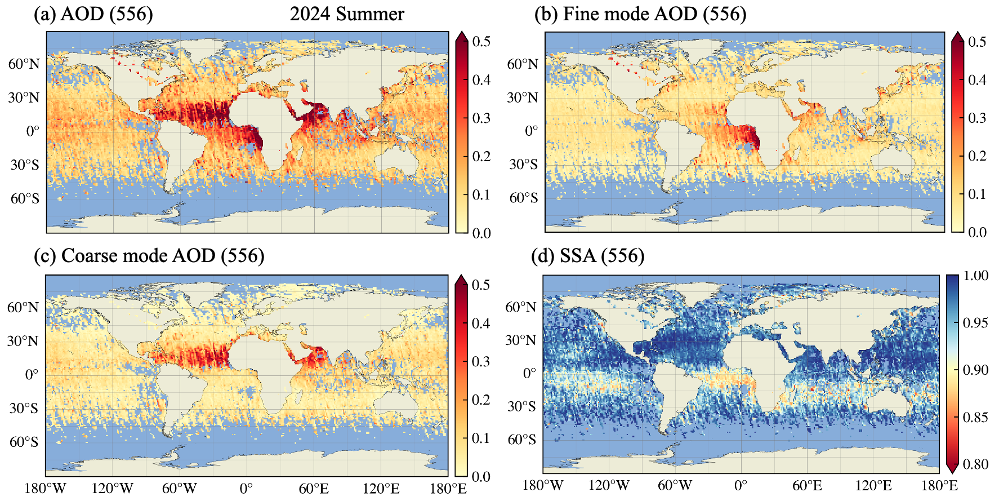
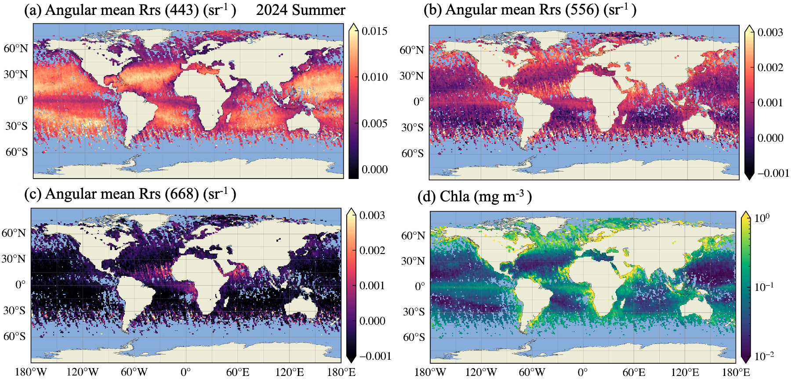

# SPEXone L2 Validation (V3)

This page summarizes validation results for aerosol and ocean products retrieved from the PACE multi-angle polarimeters using the **FastMAPOL** algorithm, with emphasis on **SPEXone** aerosol optical properties and ocean remote-sensing reflectance ($R_{rs}$).

FastMAPOL performs coupled aerosol–surface retrievals using an optimal-estimation framework accelerated by deep neural network forward models. This page focuses on the validation results and their interpretation for Version 3 (V3) data. Version 4 (V4) data show generally similar performance, as summarized in the V4 data release notes. More detailed V4 validation is ongoing. 

**Additional quantified validation results are available in @Gao:2026aa and will be updated on the [PACE FastMAPOL validation page](https://pace.oceansciences.org/pace_fastmapol.htm).**

## Summary Information

- **FastMAPOL version:** v3.0  
- **Data period:** 2024/03–2025/12  
- **Reference:** AERONET v3, Level 1.5   

## Retrieval Products Evaluated

**Aerosol**
- Total, fine-mode, and coarse-mode aerosol optical depth (AOD)
- Total, fine-mode, and coarse-mode single-scattering albedo (SSA)

**Ocean**
- Ocean remote-sensing reflectance ($R_{rs}$)

## Validation Strategy

Validation is organized into three levels:

1. **Global Level-3 assessment**  
   Evaluate large-scale spatial and seasonal patterns as shown below.

2. **Global aerosol validation**  
   Compare retrievals with AERONET observations

3. **Joint aerosol–ocean validation**  
   Evaluate aerosol and $R_{rs}$ simultaneously using AERONET-OC matchups, study the mutual dependencies on the retrieval uncertainties. 

The objective is to assess both the physical realism of the retrieved fields and the consistency of aerosol and ocean products.

## Global Level-3 Products

**Aerosol Products (556 nm)**

Global distributions of total, fine-mode, and coarse-mode AOD and SSA at 556 nm:

{#fig-validation_spexone_v3_aod width=90%}

**Ocean Products**

Global distributions of $R_{rs}$ (443, 556, 667 nm) and chlorophyll-*a*:

{#fig-validation_spexone_v3_rrs width=90%}

The retrieved $R_{rs}$ contains spectral and angular dimensions. The results shown here represent the BRDF-corrected angular mean.

**Key result:**  
The global distributions show realistic spatial and seasonal patterns, indicating effective separation of atmospheric and oceanic retrieval components.